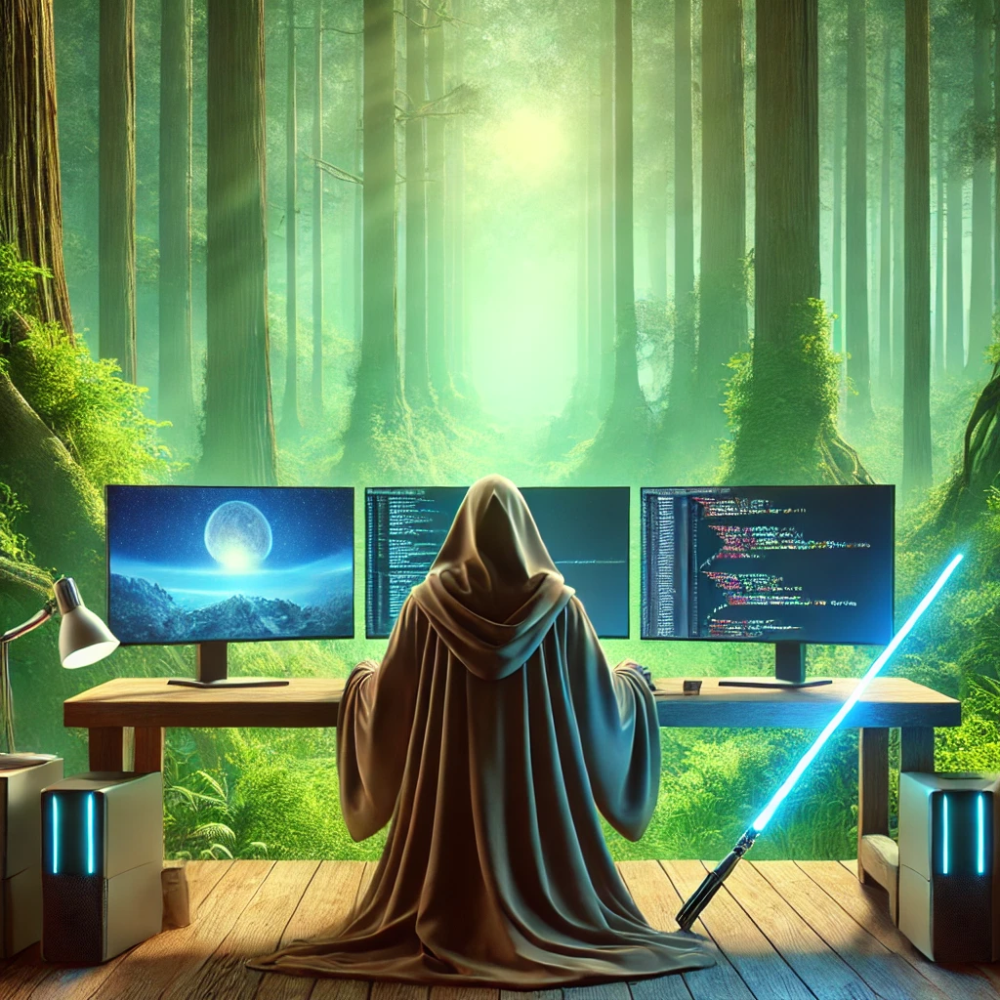

    <!-- Add two images side by side -->
    
    
     
    

<!-- Header with lightsaber colors and Jedi-inspired title -->
<h1 align="center" style="border: none; color: #0B84A5; font-family: 'Orbitron', sans-serif;">⚔️ Code-Wielding Jedi | Master of Stack & Saber | Technical Force Lead ⚔️</h1>

 

<!-- Main intro section with Jedi theme -->
👋 **Hello there!**  
I'm **Ben "Obi-Wan" Kenobi**, a former Jedi Knight turned full-stack developer, now coding in the Outer Rim. I've been debugging code since before the Clone Wars and am known for my “elegant solutions for a more civilized age.”

 

<!-- Specialties section with lightsaber color accents and coding emoji icons -->
🌌 **Specialties:**
- 🖖 Using the Force to optimize algorithms
- 🛡️ Expert in defensive coding, with high-level experience in “Hello World!” projects and sand-proof architectures (Tatooine-tested)
- ⚔️ Skilled negotiator in code conflicts, thanks to years of experience... on both sides of the Force.

 

⚔️ **Fun Facts:**
- My IDE of choice? **“A New Hope”**
- I once wrote a program so complex even Master Yoda needed a flowchart to debug it.
- Tried to teach **C#** to a Jawa once, but they only understood "droid speak." Guess we all need our own *force stack*.
- If I had a credit for every time someone said, **“This is not the bug you’re looking for”**, I’d be richer than the Trade Federation.

💡 **May your pull requests be merged without conflict, and your code be as seamless as a Jedi mind trick!**

 

<!-- Green lightsaber color for divider -->

### Connect with me through the Galaxy:

  

<!-- Social media buttons with colors inspired by lightsabers and coding icons -->

      
      
      
      

<!-- Red lightsaber color for divider -->

### 🔗 Visit my other GitHub profile:

      

    <a href="https://github.com/its-michaelroy" style="color: #FF3333; font-family: 'Orbitron', sans-serif;">🔗 Check out my primary GitHub profile</a>

<!-- Include CSS link for Orbitron font if using GitHub Pages -->
<!-- <link href="https://fonts.googleapis.com/css2?family=Orbitron&display=swap" rel="stylesheet"> -->
